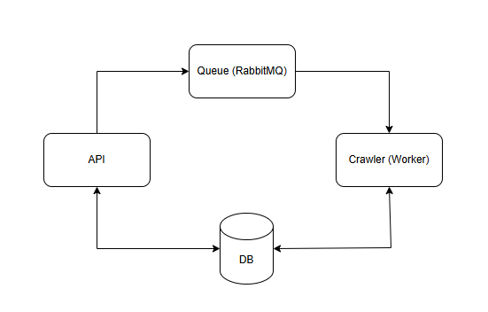
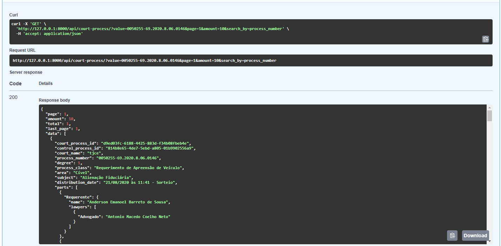
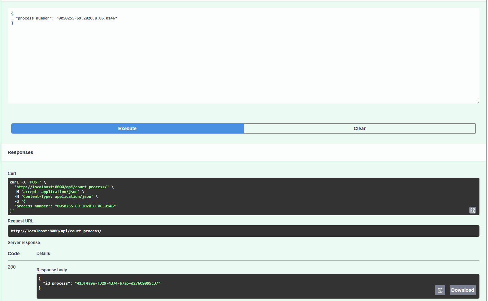
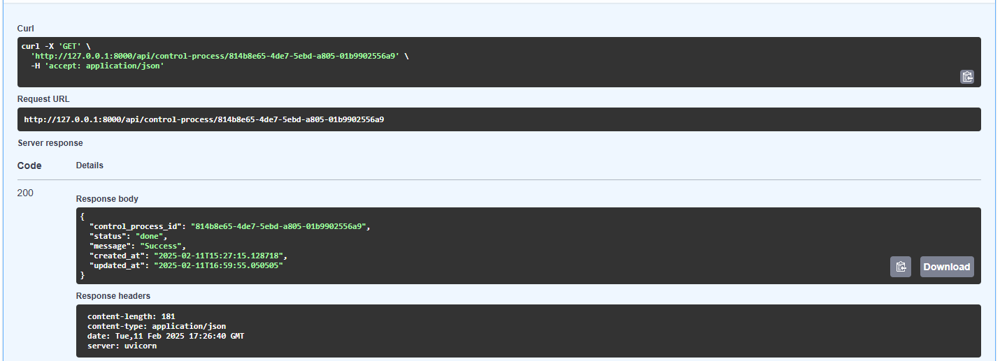
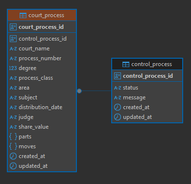

# Projeto Justice-System

## Descrição

Justice-System é um repositório que integra uma API, um crawler para extração de dados, um sistema de mensageria com RabbitMQ e um ambiente Docker Compose para facilitar a implantação. Ele é capaz de coletar dados de processos judiciais do TJAL (Tribunal de Justiça de Alagoas) e do TJCE (Tribunal de Justiça do Ceará).

## Tecnologias Utilizadas

- **Python** (FastAPI, Celery, Alembic, SQLAlchemy, Requests, BeautifulSoap)
- **RabbitMQ** (mensageria)
- **PostgreSQL** (banco de dados)
- **Docker e Docker Compose** (contêinerização e orquestração)

## Estrutura do Projeto

```
/
|-- service/   # Contém a API principal
|-- crawler/   # Contém o worker para extração de dados
|-- rabbitmq/  # Definições para o RabbitMQ
|-- docker-compose.yml  # Configuração dos contêineres
```



## Pré-requisitos

Certifique-se de ter instalado:

- [Docker](https://www.docker.com/)
- [Docker Compose](https://docs.docker.com/compose/)

## Como Rodar o Projeto

1. Clone o repositório:
   ```sh
   git clone https://github.com/AllanPS98/jus-system.git
   cd jus-system
   ```
2. Suba os contêineres com Docker Compose:
   ```sh
   docker-compose up --build
   ```
3. A API estará disponível em `http://localhost:8000`
4. A interface do RabbitMQ pode ser acessada em `http://localhost:15672` (usuário: guest, senha: guest)

## Endpoints da API

- `GET /court-process` - Recebe as informações do processo

- `POST /court-process` - Aciona o crawler para extrair informações

- `GET /control-process` - Recebe as informações da execução da extração


## DER
O diagrama é composto por duas entidades:
   - **control_process**: Faz o controle do estado da requisição de coleta de dados do processo
   - **court_process**: Armazena os dados coletados




